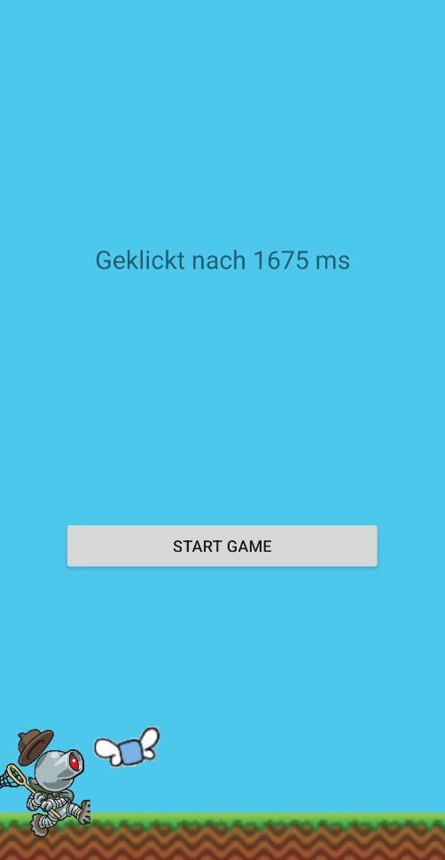

# Template for a Simple Android Reaction Game

This template can be used as a starting point for developing a android game. Since, using Threads and drawing on a Canvas can be quite unintuitive at the beginning, this template gives you a blueprint. 

I use it for the computer science summer camp at the university jena. After a short introduction pupil are able to extend it as they like. You can extend it to a flappy bird like clone or a shooting game. 

The basic game gives you a start page and after starting the game a random timer starts. When this timer exceeds an image is show and you have to click on it as fast as you can. Your reaction time is printed on the screen. 

More information about the source code and how to use it can be found at [online](https://julien-klaus.github.io/posts/2021/08/android).

